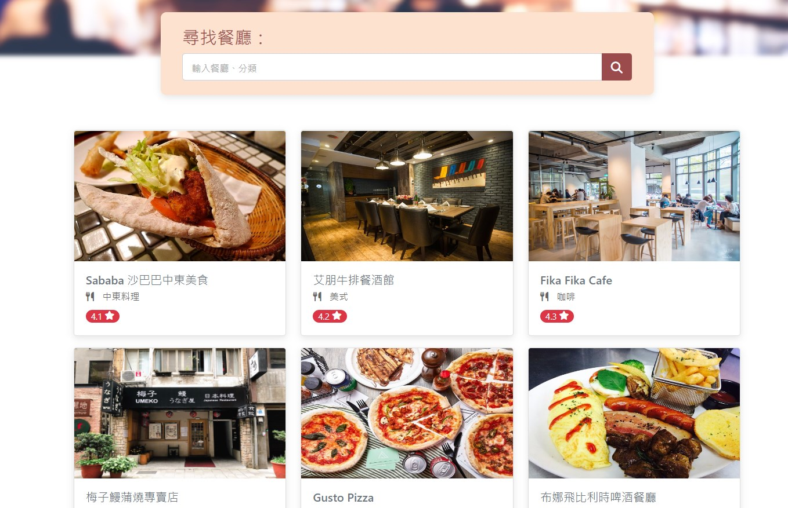

## My Restaurant List

### Intrduction

This is web application about personal restaurant list, you can login in by local or Facebook to create, edit, view and delete your own restaurant list.

### Screenshot

- Homepage
  

---

- Restaurant Info
  

### Features

- Register user profile
- Check correctness of register or login data for user
- Login by local or Facebook
- Create, edit, view and delete restaurant
- Filter restaurant list by different sortby

### Install

1. Store this project to local

```
git clone https://github.com/Coli-co/Restaurant_list.git
```

2. Switch to project folder

```
cd Restaurant_list
```

3. Install npm packages required

```
npm install
```

4. Load seed data

```
npm run seed
```

5. Start project

```
npm run start
```

### Tools

- bcryptjs: 2.4.3
- body-parser: 1.20.0
- connect-flash: 0.1.1
- dotenv: 8.2.0
- express: 4.16.4
- express-handlebars: 4.0.2
- express-session: 1.17.1
- method-override: 3.0.0
- mongoose: 5.9.7
- passport: 0.4.1
- passport-facebook: 3.0.0
- passport-local: 1.0.0

### Developer

- [Timothy](https://github.com/Coli-co)
