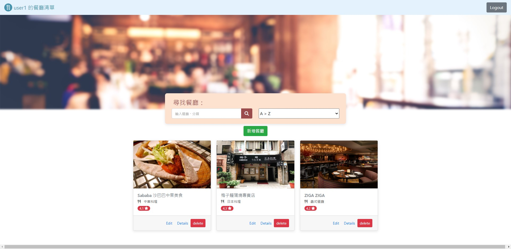

## 我的餐廳清單

### 描述

這是一個可瀏覽多張餐廳卡片，以及搜尋功能的簡易網頁應用。

### 專案畫面

- 首頁
  

---

- 餐廳資訊
  

### 功能

- 在搜尋欄搜尋餐廳
- 檢視餐廳詳細資訊

### 安裝

1. 將本專案存放至本機專案位置

```
git clone https://github.com/Coli-co/Restaurant_list.git
```

2. 切換至專案資料夾

```
cd Restaurant_list
```

3. 安裝專案所需的 npm 套件

```
npm install
```

4. 執行專案

```
nodemon app.js
```

### 路由

| Description  | Router                                              |
| ------------ | --------------------------------------------------- |
| 首頁         | http://localhost:3000                               |
| 檢視餐廳資料 | http://localhost:3000/restaurantlist/:reataurant_id |

### 開發者

- [Timothy](https://github.com/Coli-co)
